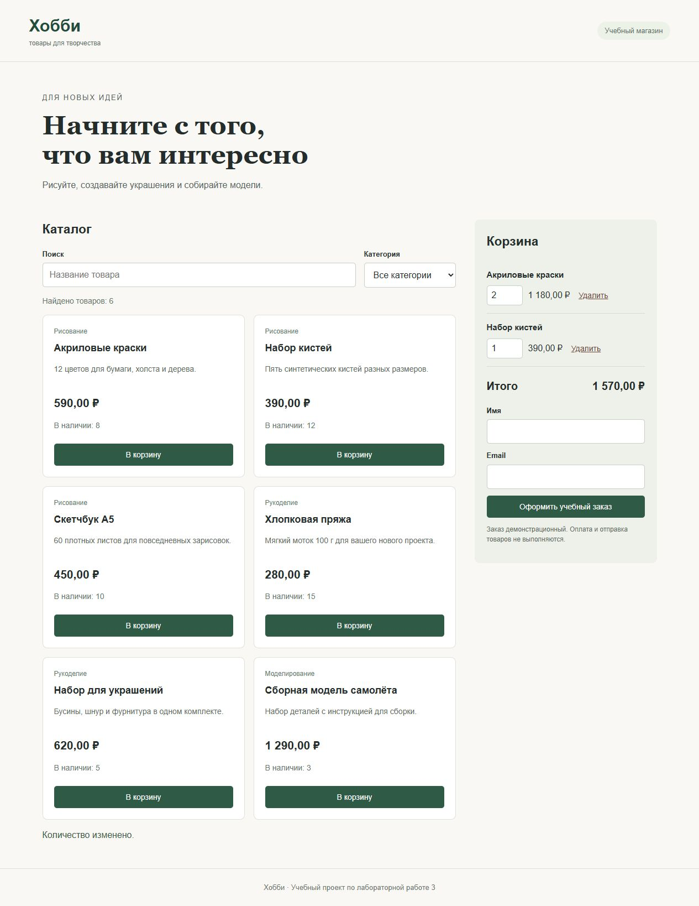
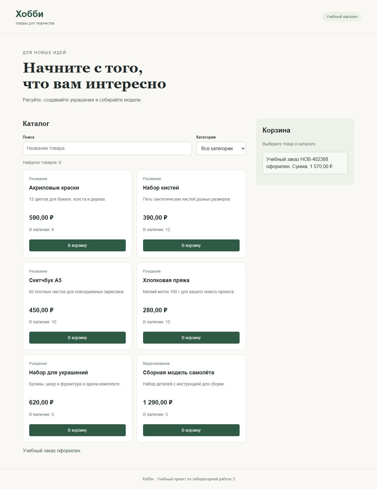

# Проверки

Автоматические тесты запускаются командой `npm test`; фактический результат — 8 из 8, в том числе в отдельно клонированном репозитории. На GitHub настроен workflow checks.

| Проверка | Ожидаемый результат | Факт |
|---|---|---|
| Поиск без учёта регистра вместе с категорией | Возвращает пересечение условий | Пройдено, автоматический тест |
| Добавление | Создаёт новое состояние, сохраняя прежнюю корзину | Пройдено, автоматический тест |
| Стоимость корзины | Корректно суммирует стоимость в копейках | Пройдено, автоматический тест |
| Количество 0 | Удаляет товар из корзины | Пройдено, автоматический тест |
| Превышение остатка | Отклоняется | Пройдено, автоматический тест |
| Отрицательное, бесконечное количество и NaN | Отклоняются | Пройдено, автоматический тест |
| Имя и email | Пустые/некорректные данные отклоняются | Пройдено, автоматический тест |
| Дробное количество 1.5 | Отклоняется | Пройдено после исправления, автоматический тест |

Проверка в браузере: поиск «кист» показал один товар; сочетание этого поиска и категории «Рукоделие» показало ноль. Две упаковки красок по 590 рублей и кисти за 390 рублей дали сумму 1570 рублей. После ввода тестовых имени и email учебный заказ подтвердился, корзина стала пустой.

Использованы вымышленные данные. Денежных операций и отправки данных покупателя на сервер нет. Нагрузочное тестирование полноценного WooCommerce-магазина не выполнялось.
